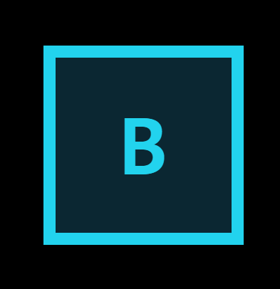

<div align="center">
  
  <h1 style="display: inline-block; vertical-align: middle; margin: 0;">BYPASSCTF </h1>
</div>

<div align="center">
  
  
  
</div>

<div align="center">
  <a href="https://bypassctf.vercel.app/" target="_blank">
    
  </a>
</div>

<br>

A cybersecurity puzzle game where players need to find hidden passwords and bypass security systems using hacking skills and creative thinking.


### 🎯 Game Posters
<div align="center">
  <table>
    <tr>
      <td align="center">
        
      </td>
      <td align="center">
        
      </td>
    </tr>
  </table>
</div>

<br>

## 🎮 About the Game

**BYPASSCTF** is an interactive cybersecurity puzzle game that challenges players to think like ethical hackers. Players must:

- **Find Hidden Passwords** - Search for clues embedded in the game interface
- **Solve Security Puzzles** - Use creative problem-solving to bypass virtual security systems  
- **Compete Globally** - Climb the leaderboard against other players

The game combines **education with entertainment**, teaching cybersecurity concepts through hands-on puzzle-solving in a safe, gamified environment. Perfect for students, security enthusiasts, and anyone curious about ethical hacking!


## 🚀 How to Clone and Setup

### 1. Clone the Repository

```powershell
git clone https://github.com/vivekkushalch/bypass.git
cd bypass
```

### 2. Backend Setup

⚠️ **VERY IMPORTANT SET THESE ENVIRONMENT VARIABLES FOR SAFETY**
```powershell

# GENERATE USING COMMAND -> openssl rand -hex 128

DB_PWD=
JWT_SEC=
```


```powershell
cd backend

# Install dependencies using uv (recommended) or pip
uv sync
# OR using pip:
# pip install -e .
```

### 3. Frontend Setup

```powershell
cd ../frontend

# Install dependencies
npm install
```

## 🎮 How to Run

### Start the Backend Server

```powershell
cd backend

# Using uv
uv run uvicorn main:app --reload --host 0.0.0.0 --port 8000

# OR using python directly
python -m uvicorn main:app --reload --host 0.0.0.0 --port 8000
```

The backend will be available at: `http://localhost:8000`

### Start the Frontend Development Server

```powershell
cd frontend

# Start the development server
npm run dev
```

The frontend will be available at: `http://localhost:5173`

## 🎮 How to Play

1. **Register**: Create an account to start playing
2. **Tutorial**: Follow the interactive tour guide
3. **Explore**: Look for hidden clues and passwords in the interface
4. **Think Creatively**: Use your cybersecurity knowledge and problem-solving skills
5. **Progress**: Advance through levels by finding the correct passwords
6. **Compete**: Check your ranking on the leaderboard

## 🎨 Screenshots

### 🎮 Game Interface
<div align="center">
  
</div>


<br>

### 🏆 Leaderboard
<div align="center">
  
</div>

<br>


<div align="center">
Made with 💖 by team Bypa$$
</div>
